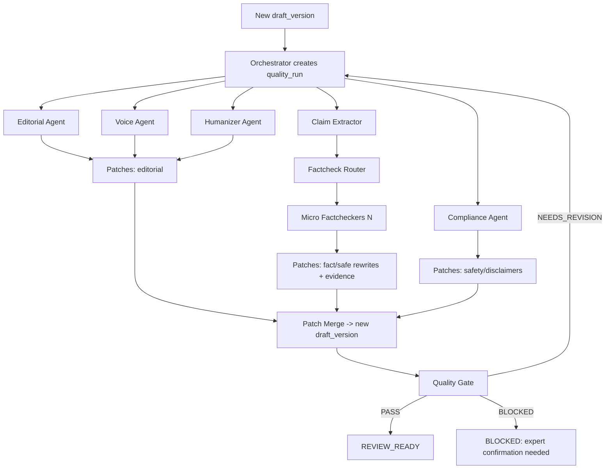

<!--
PATH: docs/agentic-editorial-loop.md
WHAT: Closed-loop agentic editorial pipeline + Voice Acquisition Layer, with concrete contracts, patch format, gating rules, idempotency, and edge cases
WHY: Turn high-level flow into implementable orchestration spec without over-architecture
RELEVANT: services/api/src/core/onboarding.ts, services/api/src/core/drafts.ts, services/api/src/core/quality-loop.ts, packages/shared/src/types/topic-draft.ts
-->

# Agentic Editorial Loop + Voice Acquisition Layer (Implementable Spec)

Метафора: **Virtual Newsroom** (редакция, а не “AI writer”).
Ключевой принцип: **каждая новая версия текста** проходит один и тот же контур качества до `REVIEW_READY` или `BLOCKED`.

---

## 0) Terms (чтобы все одинаково понимали)

* **Draft**: логическая сущность материала (topic + назначенный эксперт).
* **DraftVersion**: immutable текст + метаданные (v1, v2…).
* **QualityRun**: один запуск контура качества для конкретной версии (vN).
* **Patch**: набор правок в машинном формате (операции insert/replace/delete).
* **Claim**: проверяемое утверждение (факт/число/медицинское/юридическое).
* **Evidence**: источник/обоснование для claim (URL + snippet + статус).
* **VoiceProfile**: структурированное описание “как говорит эксперт” + границы.
* **Blocked**: невозможно безопасно довести до review-ready без подтверждения/решения эксперта.

---

## 1) Non-negotiables

1. **Immutable versions:** любое изменение → новая версия `draft_version`.
2. **Version-locked decisions:** любое approve/“готово к ревью” привязано к `draft_version_id`.
3. **Closed loop:** новый `draft_version` → автоматом стартует полный цикл качества.
4. **Safety-first order:** safety/комплаенс → факты → редактура → humanizer.
5. **Explainability:** PASS/FAIL всегда с конкретными блокерами.
6. **Bounded loops:** max 3 итерации; иначе `BLOCKED`.

---

## 2) Entities (минимум, но достаточно)

### 2.1 Voice

* `expert(id, company_id, name, role, email, status)`
* `voice_profile(expert_id, version, confidence, profile_data jsonb, updated_at)`
* `voice_signal(expert_id, source, raw_text, extracted_features jsonb, created_at)`
* `voice_session(expert_id, step, status, last_sent_at, next_action_at)`

**voice_profile.profile_data (фикс. структура)**

* `tone_tags[]` (например: calm, direct, warm, clinical)
* `signature_phrases[]` (5–15)
* `vocabulary_do[]` / `vocabulary_avoid[]`
* `sentence_style` (short/medium/long) + `reading_level` (simple/standard)
* `boundaries[]` (что нельзя утверждать/обещать)
* `required_disclaimers[]` (по вертикали)
* `banned_patterns[]` (категоричные обещания, “гарантируем”, “лечит”, “100%”)
* `citations_policy` (например: “stats запрещены без источника”)

### 2.2 Drafts & Versions

* `content_item(id, company_id, topic, assigned_expert_id, status, scheduled_at, metadata jsonb)`
* `draft(id, content_item_id, status, current_version_id)`
* `draft_version(id, draft_id, version_no, content, summary, status, created_by, created_at, parent_version_id)`
* `comment(id, draft_version_id, author_type, anchor, text, created_at)`

### 2.3 Quality + Factcheck

* `quality_run(id, draft_version_id, iteration_no, status, started_at, finished_at)`
* `quality_stage_run(id, quality_run_id, stage, status, started_at, finished_at, output_ref)`
* `claim(id, draft_version_id, claim_hash, claim_text, type, risk, verdict, notes)`
* `evidence(id, claim_id, source_url, snippet, checked_at, status)`
* `audit_log(entity_type, entity_id, event, payload jsonb, created_at)`

---

## 3) Voice Acquisition Layer (email-интервью + self-learning)

### 3.1 Цель

Собрать **живой голос** и **границы** так, чтобы:

* Draft Writer имитировал стиль эксперта,
* эксперт минимум правил,
* тексты не создавали liability.

### 3.2 Письма (MVP: 5 шагов)

Каждое письмо 2–5 минут. После каждого шага обновляем `voice_profile`.

**Email #1: Tone + Audience**

* “3 слова: как вы хотите звучать”
* “для кого пишем (новичок/продвинутый)”
* “3 фразы, которые вы часто говорите”

**Email #2: Rewrite task (ключевой сигнал)**

* Нейтральный абзац 150–200 слов
* “исправьте как вы бы сказали”

**Email #3: Q&A**

* 6 вопросов клиента
* ответы по 2–4 предложения

**Email #4: Myths**

* 5 мифов + мягкое опровержение

**Email #5: Boundaries**

* что не обещаете
* когда срочно к специалисту
* обязательные дисклеймеры

### 3.3 Reminder policy

* reminder #1 через 48h
* reminder #2 через 96h
* после 2 reminder → `voice_session.status=PAUSED` и менеджеру уведомление “эксперт занят”

### 3.4 Voice readiness thresholds

* `confidence >= 70`: VOICE_READY
* `40–70`: allowed, but must be expert-reviewed
* `<40`: no “from-expert voice”, only neutral newsroom style

### 3.5 Self-learning from edits

Любые правки эксперта в документе (diff) → `voice_signal(source=edit_diff)` → обновление signature phrases, vocabulary_avoid, boundaries.

---

## 4) Agent Network (конкретные обязанности)

### 4.1 Orchestrator

* принимает событие `draft_version.created`
* создает `quality_run(iteration_no=1)`
* запускает стадии в порядке, управляет retries/timeouts
* обеспечивает idempotency (см. раздел 6)
* при конфликтах версий “схлопывает” устаревшие runs

### 4.2 Quality Agents

**E1 Editorial Agent**

* структура, ясность, логика, читабельность
* выводит patch-операции (не “советы”)

**E2 Voice Consistency Agent**

* проверяет соответствие `voice_profile`
* добавляет signature phrases, корректирует тональность, убирает запреты

**E3 Humanizer Agent**

* удаляет AI-клише, делает текст естественным
* правило: не добавлять новые факты

**F1 Claim Extractor**

* выделяет claims + type + risk
* создает устойчивый `claim_hash`

**F2 Factcheck Router**

* decide per claim: VERIFY / SAFE_REWRITE / REMOVE / EXPERT_CONFIRM
* policy: high-risk всегда VERIFY или SAFE_REWRITE/REMOVE

**F3 Micro Factcheckers (N)**

* 1 агент = 1 claim
* возвращают evidence + verdict + safe rewrite

**S1 Compliance/Safety Agent**

* запрещенные обещания, опасные советы, категоричность
* проверка дисклеймера по вертикали
* правило: при сомнении смягчать/удалять

**M1 Patch Merge Agent**

* собирает patches всех агентов
* применяет в правильном порядке
* создает новую версию `draft_version_{n+1}`
* генерирует `change_summary`

**G1 Quality Gate**

* PASS/NEEDS_REVISION/BLOCKED
* возвращает список blockers (с кодами)

---

## 5) Agent Contracts (Input/Output) — чтобы оркестратор был реальным

### 5.1 Общий input контекст для агентов

```json
{
  "company_profile": { "niche": "...", "constraints": ["no_promises", "no_unsupported_stats"], "disclaimers": ["..."] },
  "expert": { "name": "...", "role": "..." },
  "voice_profile": { "version": 3, "confidence": 78, "tone_tags": ["calm","direct"], "signature_phrases": ["..."], "banned_patterns": ["..."] },
  "draft_version": { "id": "dv_123", "version_no": 2, "content": "..." },
  "history": { "previous_blockers": ["CLAIM_UNVERIFIED"], "prior_changes_summary": "..." }
}
```

### 5.2 Patch format (обязательный, машинный)

Все агенты, кроме Claim Extractor/Factcheckers, возвращают patches:

```json
{
  "patches": [
    {
      "op": "replace",
      "anchor": { "quote": "original exact snippet", "fallback": "short unique substring" },
      "text": "new snippet",
      "reason_code": "EDITOR_CLARITY",
      "severity": "med"
    }
  ],
  "notes": ["1–5 short bullets for explainability"]
}
```

**Почему anchor через quote:** устойчивее, чем “позиции”, при изменениях.

### 5.3 Claim Extractor output

```json
{
  "claims": [
    {
      "claim_text": "…",
      "claim_hash": "sha256(normalized_claim_text)",
      "type": "medical_fact|legal_statement|statistic|definition|recommendation",
      "risk": "high|med|low",
      "why": "short reason"
    }
  ]
}
```

### 5.4 Micro Factchecker output (на один claim)

```json
{
  "claim_hash": "...",
  "verdict": "confirmed|needs_rewrite|unverifiable|unsafe",
  "evidence": [
    { "source_url": "...", "snippet": "...", "status": "ok|weak" }
  ],
  "safe_rewrite": "suggested safer wording (optional)",
  "notes": "1 short line"
}
```

### 5.5 Quality Gate output (блокеры с кодами)

```json
{
  "decision": "PASS|NEEDS_REVISION|BLOCKED",
  "blockers": [
    { "code": "CLAIM_UNVERIFIED_HIGH", "detail": "claim_hash=...", "fix_hint": "remove or soften" },
    { "code": "PROMISE_LANGUAGE", "detail": "found 'guaranteed'", "fix_hint": "rephrase to non-absolute" }
  ],
  "scores": { "voice": 0.82, "readability": 0.76, "risk": 0.12 }
}
```

---

## 6) Orchestration rules (без хаоса)

### 6.1 Event triggers

* `draft_version.created` → старт QualityRun
* `comment.added` / `doc.edited` → создать новую draft_version → старт QualityRun
* `voice_signal.created` → update voice_profile (не блокирует контент)

### 6.2 Idempotency

Ключи идемпотентности:

* `quality_run_key = draft_version_id + iteration_no`
* `stage_run_key = quality_run_id + stage`

Повторный запуск с тем же ключом должен возвращать тот же результат или “already done”.

### 6.3 Concurrency (главная боль)

Если пользователь редактирует, пока идет цикл:

* создается новая `draft_version` (vN+1)
* текущий `quality_run` для vN помечается `SUPERSEDED`
* запускается новый run для vN+1

### 6.4 Iteration policy

* `MAX_LOOPS=3`
* после каждого merge создается новая версия и новый run
* если после 3 итераций blockers остаются → `BLOCKED`

---

## 7) Factcheck policy (что делать, если не проверяется)

Правила по умолчанию:

1. **Статистика без источника запрещена** → SAFE_REWRITE или REMOVE.
2. **High-risk claim**:

   * если нет strong evidence → SAFE_REWRITE (смягчение) или REMOVE
   * если важен смысл и нельзя удалить → EXPERT_CONFIRM (перевести в вопрос эксперту)
3. **Evidence tiers** (для отчета):

   * strong: официальные/регуляторы/мед. учреждения/университеты
   * weak: блог/маркетинговые страницы
     MVP: можно не автоматизировать whitelist доменов, но хранить `status=weak/ok`.

---

## 8) Humanizer rules (чтобы не ломал факты)

Humanizer обязан:

* не добавлять новые числа, диагнозы, юридические утверждения
* не менять смысл safety-ограничений
* может менять ритм, связки, повторы, клише

Если Humanizer затронул предложения с claims → пометить “needs re-check impacted claims”.

---

## 9) Closed Loop (stage order)

**Stage A: Editorial**

* E1 Editorial → patches
* E2 Voice → patches
* E3 Humanizer → patches

**Stage B: Claims + Factcheck + Compliance**

* F1 claims extract
* F2 router
* F3 micro checks
* S1 compliance patches

**Stage C: Merge**

* M1 merge patches (order: safety → facts → editorial → humanize)
* create new version

**Stage D: Gate**

* G1 PASS/NEEDS_REVISION/BLOCKED

---

## 10) Mermaid (единая схема)



---

## 11) Edge cases (обязательные)

1. **Old thread comments**: комментарий пришёл к старой версии → перенести в latest и уведомить.
2. **Conflicting reviewer comments**: два ревьюера требуют разные вещи → Merge Agent формирует “decision points” для менеджера.
3. **Claims changed across versions**: сравнивать `claim_hash` по версиям и проверять заново только изменённые/затронутые.
4. **No voice ready**: писать нейтрально, помечать “voice pending”, обязательно review эксперта.

---

## 12) Acceptance criteria (E2E)

1. Любая новая версия проходит цикл и получает `REVIEW_READY` или `BLOCKED` с блокерами.
2. Любая правка эксперта создает новую версию и запускает цикл снова.
3. High-risk claims не попадают в review-ready без evidence или safe rewrite/remove.
4. Все действия пишутся в audit_log (минимум: run started, stage finished, version created, gate decision).
5. VoiceProfile обновляется после каждого voice reply и после значимых edit_diff.

---

## 13) Short prompts for Spec Kit

P1: “Сгенерируй спецификацию оркестратора по разделу 6: события, idempotency, concurrency, iteration policy.”
P2: “Сгенерируй JSON контракты агентов по разделу 5 и patch format.”
P3: “Сгенерируй правила Gate (blocker codes) и пороги PASS/FAIL.”
P4: “Сгенерируй edge-case handling и тестовый план (golden runs).”
P5: “Сгенерируй минимальные таблицы Postgres под Entities из раздела 2.”
