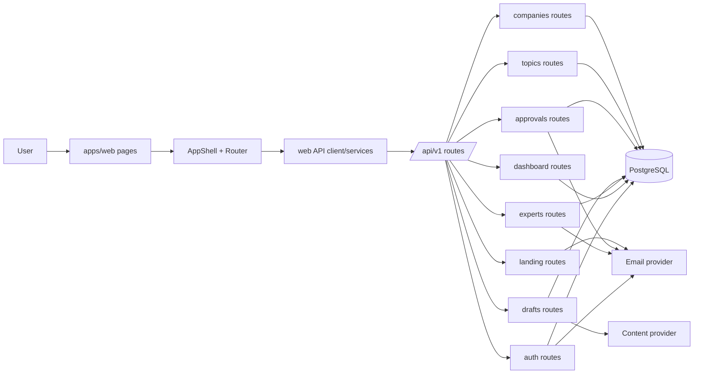
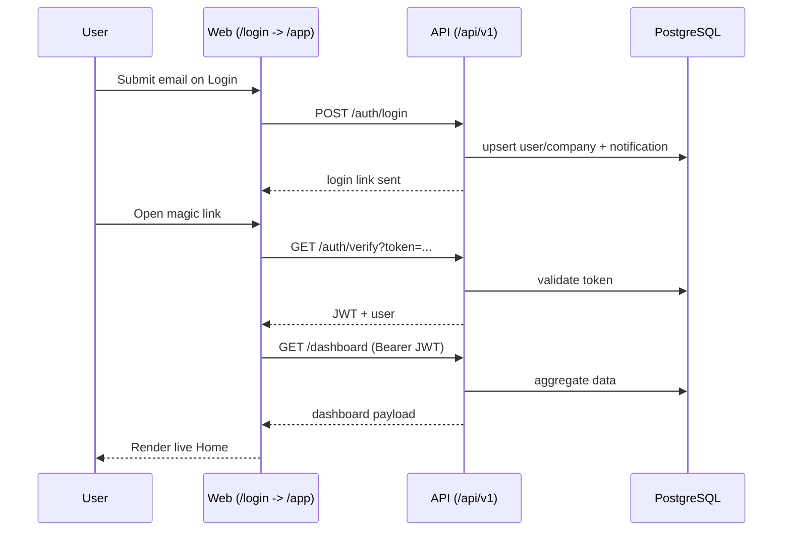

<!--
PATH: docs/frontend-backend-gap-map.md
WHAT: Полная карта frontend действий, backend endpoint-ов и API gap-ов
WHY: Быстро увидеть что уже покрыто и где нужны адаптеры или новые контракты
RELEVANT: specs/003-frontend-snapshot-import/api-compat-matrix.md,specs/004-api-adapter-integration/plan.md,services/api/src/routes/index.ts
-->

# Frontend <-> Backend Gap Map

Источник: текущее состояние `apps/web` после snapshot 1:1 и маршруты в `services/api/src/routes/*`.

## 1) Действия во фронтенде, связанные с backend и БД

| Экран                               | Действие                                   | Нужный endpoint                                                     | Затрагиваемые данные БД                                         | Статус         |
| ----------------------------------- | ------------------------------------------ | ------------------------------------------------------------------- | --------------------------------------------------------------- | -------------- |
| Landing (`/`)                       | Отправить Request Beta Access              | `POST /api/v1/landing/requests`                                     | Нет записи в БД (email only)                                    | partial        |
| Login (`/login`)                    | Отправить magic link                       | `POST /api/v1/auth/login`                                           | `user`, `company`, `notification`                               | match          |
| Login (`/login`)                    | Подтвердить magic link                     | `GET /api/v1/auth/verify`                                           | `notification`, `user`                                          | match          |
| Home (`/app`)                       | Загрузить дашборд                          | `GET /api/v1/dashboard`                                             | drafts/approvals/experts агрегаты                               | adapter-needed |
| Experts (`/app/experts`)            | Список экспертов                           | `GET /api/v1/experts`                                               | `expert`, `onboarding_sequence`, `voice_profile`                | adapter-needed |
| Experts (`/app/experts/:id`)        | Профиль эксперта                           | `GET /api/v1/experts/:id`                                           | `expert`, `voice_profile`                                       | adapter-needed |
| Experts (`/app/experts/:id`)        | Request 2 minutes                          | `POST /api/v1/experts/:id/ping`                                     | `notification`, `audit_log`                                     | adapter-needed |
| Expert Setup (`/app/experts/setup`) | Создать эксперта                           | `POST /api/v1/experts`                                              | `expert` + onboarding bootstrapping                             | adapter-needed |
| Expert Setup (`/app/experts/setup`) | Сохранить расширенный профиль/теги/sources | Нет явного update endpoint                                          | Нет контракта для полного setup save                            | backend-gap    |
| Drafts (`/app/drafts`)              | Список драфтов                             | `GET /api/v1/drafts`                                                | `draft`, `topic`, `expert`, `draft_version`, `factcheck_report` | adapter-needed |
| Draft Editor (`/app/drafts/:id`)    | Загрузить карточку драфта                  | `GET /api/v1/drafts/:id`                                            | `draft`, `topic`, `expert`, `approval_flow/step`, `comment`     | adapter-needed |
| Draft Editor (`/app/drafts/:id`)    | Загрузить версии                           | `GET /api/v1/drafts/:id/versions`                                   | `draft_version`                                                 | adapter-needed |
| Draft Editor (`/app/drafts/:id`)    | Сохранить версию                           | `POST /api/v1/drafts/:id/versions`                                  | `draft_version`, `audit_log`                                    | adapter-needed |
| Draft Editor (`/app/drafts/:id`)    | Generate                                   | `POST /api/v1/drafts/:id/generate` (SSE)                            | `draft_version`, `draft.status`                                 | adapter-needed |
| Draft Editor (`/app/drafts/:id`)    | Factcheck                                  | `POST /api/v1/drafts/:id/factcheck` (SSE)                           | `claim`, `factcheck_report`, `draft.status`                     | adapter-needed |
| Draft Editor (`/app/drafts/:id`)    | Revise                                     | `POST /api/v1/drafts/:id/revise` (SSE)                              | `draft_version`, `draft.status`                                 | adapter-needed |
| Draft Editor (`/app/drafts/:id`)    | Send for review                            | `POST /api/v1/drafts/:id/send-for-review`                           | `approval_flow`, `approval_step`, `notification`, `audit_log`   | adapter-needed |
| Draft Editor (`/app/drafts/:id`)    | Добавить комментарий                       | `POST /api/v1/drafts/:id/comments`                                  | `comment`                                                       | adapter-needed |
| Draft Editor (`/app/drafts/:id`)    | Подтвердить claim                          | `POST /api/v1/drafts/:id/claims/:claim_id/expert-confirm`           | `factcheck_report`, `audit_log`                                 | adapter-needed |
| Create Draft (`/app/drafts/new`)    | Список тем                                 | `GET /api/v1/topics`                                                | `topic`                                                         | adapter-needed |
| Create Draft (`/app/drafts/new`)    | Создать тему                               | `POST /api/v1/topics`                                               | `topic`                                                         | adapter-needed |
| Create Draft (`/app/drafts/new`)    | Approve/Reject темы                        | `POST /api/v1/topics/:id/approve`, `POST /api/v1/topics/:id/reject` | `topic`, `audit_log`                                            | adapter-needed |
| Create Draft (`/app/drafts/new`)    | Создать драфт из темы                      | `POST /api/v1/drafts`                                               | `draft`                                                         | adapter-needed |
| Approvals (`/app/approvals`)        | Список pending                             | `GET /api/v1/approvals?view=...`                                    | `approval_step`, `approval_flow`, `draft`, `topic`              | adapter-needed |
| Approvals (`/app/approvals`)        | Gentle reminder                            | `POST /api/v1/approvals/:stepId/remind`                             | `notification`, `audit_log`                                     | adapter-needed |
| Approvals (`/app/approvals`)        | Forward reviewer                           | `POST /api/v1/approvals/:stepId/forward`                            | `approval_step`, `notification`, `audit_log`                    | adapter-needed |
| Approvals (`/app/approvals`)        | Resolve bottlenecks bulk                   | Нет явного bulk endpoint                                            | Нет контракта на массовую операцию                              | backend-gap    |
| Calendar (`/app/calendar`)          | События календаря                          | `GET /api/v1/drafts` (+filters)                                     | `draft` + joins                                                 | adapter-needed |
| Settings (`/app/settings`)          | Прочитать workspace                        | `GET /api/v1/companies/me`                                          | `company`                                                       | adapter-needed |
| Settings (`/app/settings`)          | Обновить workspace/defaults                | Нет `PATCH/PUT /api/v1/companies/me`                                | Нет write-контракта                                             | backend-gap    |
| Settings (`/app/settings`)          | Team invite/role management                | Нет users/team endpoint                                             | Нет write/read-контракта                                        | backend-gap    |

## 2) Endpoint-ы, которые уже есть в backend

База API: `services/api/src/app.ts` монтирует `buildApiRouter` под `/api/v1`.

### Public

- `GET /health`
- `POST /api/v1/auth/login`
- `GET /api/v1/auth/verify`
- `POST /api/v1/landing/requests`
- `GET /api/v1/docs/:draft_id?token=...`
- `POST /api/v1/webhooks/email/inbound`
- `POST /api/v1/webhooks/email/click`
- `GET /api/v1/webhooks/email/click`
- `POST /api/v1/drafts/:id/voice-rating` (token)
- `GET /api/v1/drafts/:id/voice-rating` (token)

### Auth required (Bearer)

- `GET /api/v1/dashboard`
- `GET /api/v1/companies/me`
- `POST /api/v1/experts`
- `GET /api/v1/experts`
- `GET /api/v1/experts/:id`
- `GET /api/v1/experts/:id/onboarding`
- `POST /api/v1/experts/:id/ping`
- `GET /api/v1/topics`
- `POST /api/v1/topics`
- `POST /api/v1/topics/:id/approve`
- `POST /api/v1/topics/:id/reject`
- `POST /api/v1/drafts`
- `GET /api/v1/drafts`
- `GET /api/v1/drafts/:id`
- `GET /api/v1/drafts/:id/versions`
- `POST /api/v1/drafts/:id/versions`
- `POST /api/v1/drafts/:id/generate` (SSE)
- `POST /api/v1/drafts/:id/factcheck` (SSE)
- `POST /api/v1/drafts/:id/revise` (SSE)
- `POST /api/v1/drafts/:id/send-for-review`
- `POST /api/v1/drafts/:id/comments`
- `POST /api/v1/drafts/:id/claims/:claim_id/expert-confirm`
- `GET /api/v1/audit`
- `GET /api/v1/approvals`
- `POST /api/v1/approvals/:stepId/remind`
- `POST /api/v1/approvals/:stepId/forward`
- `GET /api/v1/reports/monthly`

### Cron/service

- `GET /api/cron/daily`
- `GET /api/cron/digest`

## 3) Текущие gap-ы (приоритизация)

- `P0` Frontend adapters: почти все app-экраны все еще на локальных массивах/demo-state, хотя endpoint-ы уже есть.
- `P1` Settings write API: нет endpoint-ов для обновления company/defaults и управления users/roles.
- `P1` Expert setup save API: нет явного update endpoint под расширенный setup flow.
- `P2` Landing persistence: `landing/requests` сейчас email-only, без БД-следа.
- `P2` Approvals bulk ops: нет массовых endpoint-ов для "resolve bottlenecks".

## 4) Схема взаимодействия элементов

## 5) Что делать дальше (коротко)

1. Поднять Phase A-B из `specs/004-api-adapter-integration/tasks.md`.
2. Сначала auth + общий API-клиент, потом Home/Experts/Drafts.
3. После каждого блока обновлять статус в `specs/003-frontend-snapshot-import/api-compat-matrix.md`.
